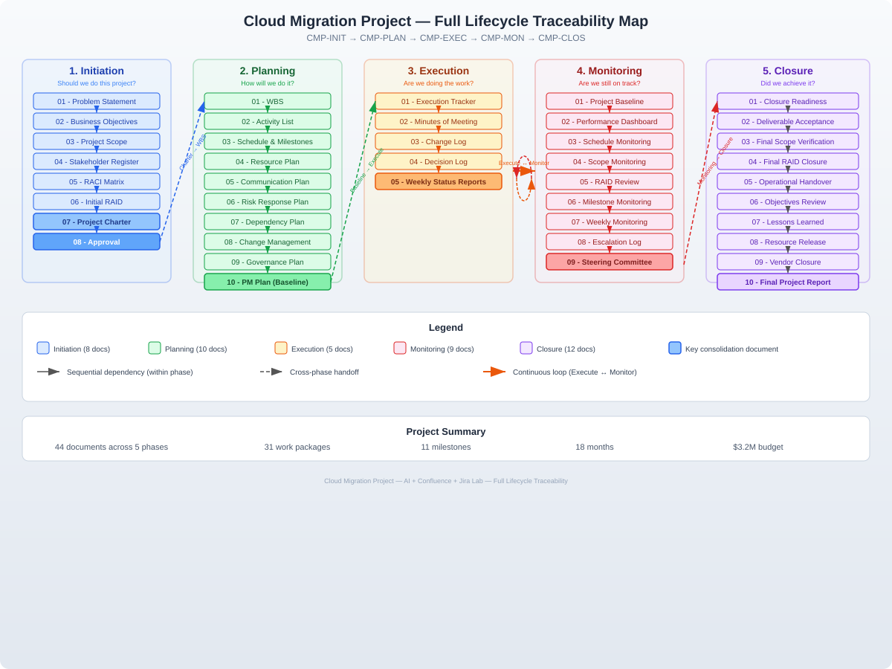

# AI for Project Managers

A comprehensive collection of AI-powered project management templates, guides, and traceability maps designed to streamline project delivery across all phases.

## 📋 Overview

This repository provides a complete framework for project managers, combining traditional project management methodologies with AI-powered prompts and tools. Each project phase includes detailed templates, checklists, and AI prompt guides to enhance efficiency and effectiveness.

## 🗂️ Repository Structure

The repository is organized across **5 key project phases**:

### 1. **Initiation Phase** 
- Problem Statement
- Business Objectives and Success Criteria
- Project Scope
- Stakeholder Register
- RACI Matrix
- Initial RAID (Risks, Assumptions, Issues, Dependencies)
- Project Charter
- Approval Authorization
- **AI Prompts Guide** for Initiation

### 2. **Planning Phase** 📅
- Work Breakdown Structure (WBS)
- Activity List
- Schedule and Milestones
- Resource Plan
- Communication Plan
- Risk Response Plan
- Dependency Plan
- Change Management Plan
- Governance and Reporting Plan
- Project Management Plan
- **AI Prompts Guide** for Planning

### 3. **Execution Phase** ⚙️
- Execution Tracker
- Minutes of Meeting
- Change Log
- Decision Log
- Weekly Status Reports
- **AI Prompts Guide** for Execution

### 4. **Monitoring Phase** 📊
- Project Baseline
- Performance Dashboard
- Schedule Monitoring
- Scope Monitoring
- RAID Review
- Milestone Monitoring
- Weekly Monitoring Reports
- Escalation Log
- Steering Committee Updates
- **AI Prompts Guide** for Monitoring

### 5. **Closure Phase** ✅
- Closure Readiness Checklist
- Deliverable Acceptance
- Final Scope Verification
- Final RAID Closure
- Operational Handover
- Objectives and Success Criteria Review
- Lessons Learned
- Resource Release
- Vendor and Contract Closure
- Final Project Report
- Final Closure Checklist
- Sponsor Closure Approval
- **AI Prompts Guide** for Closure

## 📄 Document Naming Convention

Files follow a structured naming pattern:
- **00** - Traceability Maps (phase overview)
- **01-12** - Sequential document templates within each phase
- **AI Prompts Guide** - Phase-specific AI prompt collections

##  AI Integration

Each phase includes a dedicated **AI Prompts Guide** that provides:
- Context-specific prompts for document creation
- Automated analysis templates
- Decision support frameworks
- Reporting and communication aids

## 🔗 Traceability

The **traceability-map.svg** provides a visual representation of how documents and deliverables flow across all project phases, ensuring complete traceability from initiation to closure.

##  How to Use

1. **Identify your project phase** (Initiation, Planning, Execution, Monitoring, or Closure)
2. **Review the traceability map** to understand document relationships
3. **Use the templates** (numbered 01-12) for structured project documentation
4. **Leverage AI Prompts Guides** to accelerate document creation and analysis
5. **Customize templates** to fit your specific project needs

## 🎯 Key Benefits

- ✅ Comprehensive coverage of all project management phases
- ✅ AI-powered efficiency gains
- ✅ Industry-standard templates and frameworks
- ✅ Complete traceability and audit trail
- ✅ Ready-to-use checklists and guides
- ✅ Scalable for projects of any size

## 📝 File Formats

All documents are provided in **PDF format** for easy viewing and printing.

## 🚀 Getting Started

1. Download the **traceability-map.svg** to understand the overall framework
2. Start with the **Initiation Phase** documents if beginning a new project
3. Reference the **AI Prompts Guides** throughout your project lifecycle
4. Use the **Closure Phase** checklists to ensure complete project handover

## 📖 Documentation Outline

### Phase 1: Initiation Documentation
- **00** - Traceability Map: Overview of initiation deliverables
- **01** - Problem Statement: Define the core problem
- **02** - Business Objectives and Success Criteria: Measurable goals
- **03** - Project Scope: Boundaries and deliverables
- **04** - Stakeholder Register: Key stakeholders and interests
- **05** - RACI Matrix: Roles and responsibilities
- **06** - Initial RAID: Early risk identification
- **07** - Project Charter: Formal project authorization
- **08** - Approval Authorization: Sign-off documentation

### Phase 2: Planning Documentation
- **00** - Traceability Map: Planning phase overview
- **01** - Work Breakdown Structure: Hierarchical task decomposition
- **02** - Activity List: Detailed task inventory
- **03** - Schedule and Milestones: Timeline and key dates
- **04** - Resource Plan: Human and material resources
- **05** - Communication Plan: Stakeholder communication strategy
- **06** - Risk Response Plan: Mitigation strategies
- **07** - Dependency Plan: Task relationships
- **08** - Change Management Plan: Change control process
- **09** - Governance and Reporting Plan: Oversight structure
- **10** - Project Management Plan: Comprehensive plan document

### Phase 3: Execution Documentation
- **00** - Traceability Map: Execution phase overview
- **01** - Execution Tracker: Task completion monitoring
- **02** - Minutes of Meeting: Meeting documentation
- **03** - Change Log: Change request tracking
- **04** - Decision Log: Key decisions record
- **05** - Weekly Status Reports: Progress updates

### Phase 4: Monitoring Documentation
- **00** - Traceability Map: Monitoring phase overview
- **01** - Project Baseline: Approved baseline metrics
- **02** - Performance Dashboard: KPI visualization
- **03** - Schedule Monitoring: Timeline tracking
- **04** - Scope Monitoring: Scope creep prevention
- **05** - RAID Review: Ongoing risk management
- **06** - Milestone Monitoring: Key deliverable tracking
- **07** - Weekly Monitoring Reports: Status reporting
- **08** - Escalation Log: Issue escalation tracking
- **09** - Steering Committee Updates: Executive reporting

### Phase 5: Closure Documentation
- **00** - Traceability Map: Closure phase overview
- **01** - Closure Readiness Checklist: Pre-closure verification
- **02** - Deliverable Acceptance: Formal acceptance
- **03** - Final Scope Verification: Scope completion check
- **04** - Final RAID Closure: Close all open items
- **05** - Operational Handover: Transition to operations
- **06** - Objectives and Success Criteria Review: Goal assessment
- **07** - Lessons Learned: Knowledge capture
- **08** - Resource Release: Team and resource release
- **09** - Vendor and Contract Closure: Contract completion
- **10** - Final Project Report: Comprehensive closure report
- **11** - Final Closure Checklist: Complete closure verification
- **12** - Sponsor Closure Approval: Formal project closure

## 🤝 Contributing

Contributions are welcome! Please feel free to submit issues and pull requests.

## 📄 License

This project is open source and available for project managers worldwide.

## 💬 Support

For questions or suggestions, please open an issue in this repository.

---

**Made with ❤️ for Project Managers leveraging AI**
